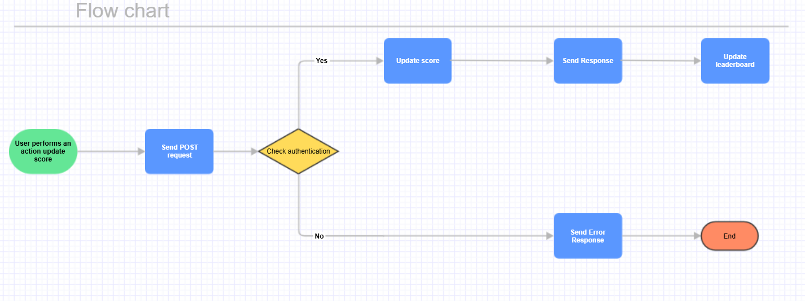

# Score Real-time Update Architecture

## Overview Module

The Score Update API Module is responsible for handling score updates for users on the scoreboard of our website. It ensures that the top 10 users' scores are displayed live and secures the update process from unauthorized access.

## Key Features

- **Live Score Updates**: Automatically updates the scoreboard to reflect the latest scores without requiring page refresh.
- **Score Update Request Handling**: Listens for API calls from user actions to increase their score.
- **Authorization and Validation**: Implements checks to prevent score manipulations by unauthorized users.

## API Endpoints

### 1. Update User Score

- **Endpoint**: `/api/scores/update`
- **Method**: `POST`
- **Headers Authorization**: Bearer token (JWT containing userId)
- **Request Payload**:

    ```json
    {
        "scoreIncrement": "integer",
    }

- **Response**:
    - 200 OK: 
    ```json
    {
        "success": true,
        "newScore": "integer"
    }
    - 401 Unauthorized:
    ```json
    {
        "success": false,
        "message": "User unauthorized"
    }
    - 400 Bad Request
    ```json
    {
        "success": false,  
        "message": "Invalid input"  
    }

### 2. Test
- **Unit Tests**:
    - Authentication Function Test: Test whether the authentication function returns true for valid tokens and false for invalid tokens.
    ```javascript 
    describe('Authorization', () => {
        it('should return true for valid authToken', () => {
            const isValid = validateAuthToken(validAuthToken);
            expect(isValid).toBe(true);
        });  

        it('should return false for invalid authToken', () => {
            const isValid = validateAuthToken(invalidAuthToken);
            expect(isValid).toBe(false);
        });
    });
    - Score Update Function Test: Ensure that the score updating function works correctly when receiving valid input or returns an error for invalid input.
    ```javascript
    describe('Update Score', () => {
        it('should update score correctly for valid request', () => {
            const result = updateScore(userIdExists, scoreIncrement);
            expect(result.newScore).toBe(expectedNewScore);
        });

        it('should throw error for userId is not exists', () => {
            expect(() => updateScore(userIdNotExists, scoreIncrement))
            .toThrow('User is not exists');
        });
    });
- **Integration Tests**: Test the entire workflow of the API, including interactions with the database and other dependencies.
    - Valid Input Test: Send a POST request to /api/scores/update with a valid token and check the response.
    - Invalid Input Test: Send a request with an invalid token and check the error response.
    - Rate Limiting Test: Send multiple update requests in quick succession and check for error messages. Assume that the user cannot update continuously 5 times.
    ```javascript
    describe('Rate Limiting', () => {  
        it('should limit score updates', async () => {  
            for (let i = 0; i < 4; i++) {  
                await request(app)  
                    .post('/api/scores/update')  
                    .set('Authorization', `Bearer ${validAuthToken}`)
                    .send({  
                        scoreIncrement: 10,  
                    });  
            } 

            // Check response
            expect(response.status).toBe(429); // Status code for Too Many Requests
            expect(response.body.success).toBe(false);  
            expect(response.body.message).toMatch(/Rate limit exceeded/);  
        });  
    });


## Security Measures
- Authentication: Each request must include a valid authToken which verifies the user’s identity.
- Rate Limiting: Implement rate limits to prevent abuse (e.g., maximum 5 score updates per minute).
- Input Validation: Validate user IDs and score increments to guard against SQL injection or other attacks.

## Flow of Execution
User Action Completed: User performs an action that triggers a score update on UI.
API Call: The front-end makes a POST request to /api/scores/update.
Authentication Check: The API validates the user's authToken.
Score Update: If valid, the score is updated in the database.
Response Returned: The server sends back the new score or an error message if unauthorized/invalid request.
Live Update to Scoreboard: The front end listens for changes and updates the scoreboard in real-time.

